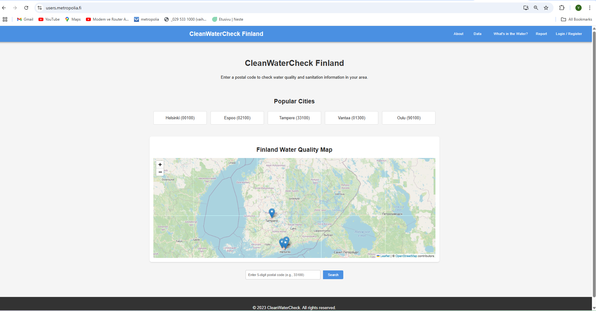
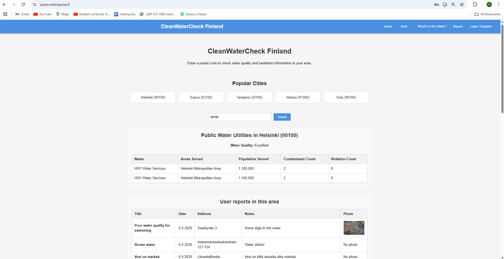
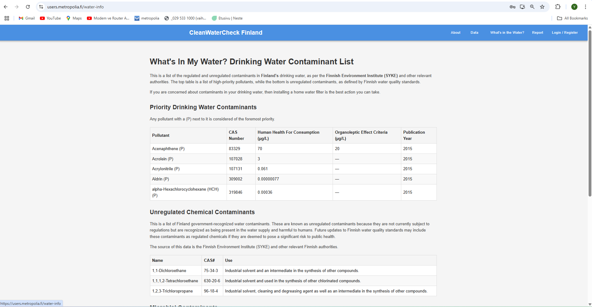
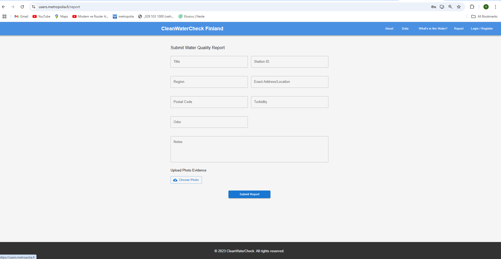
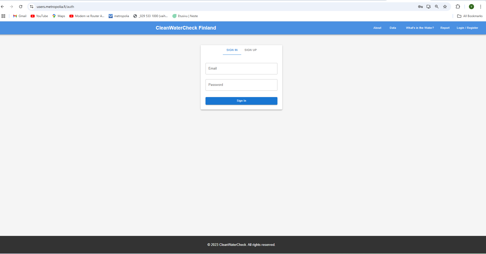
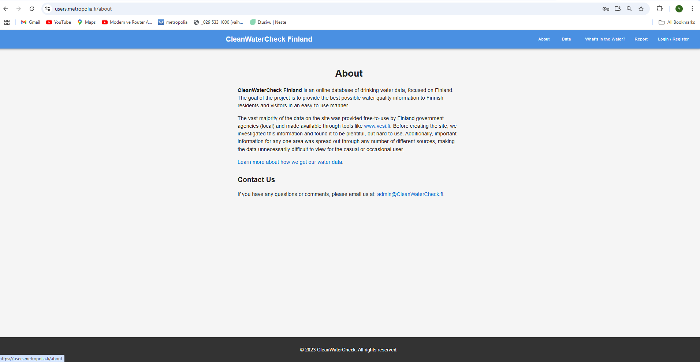
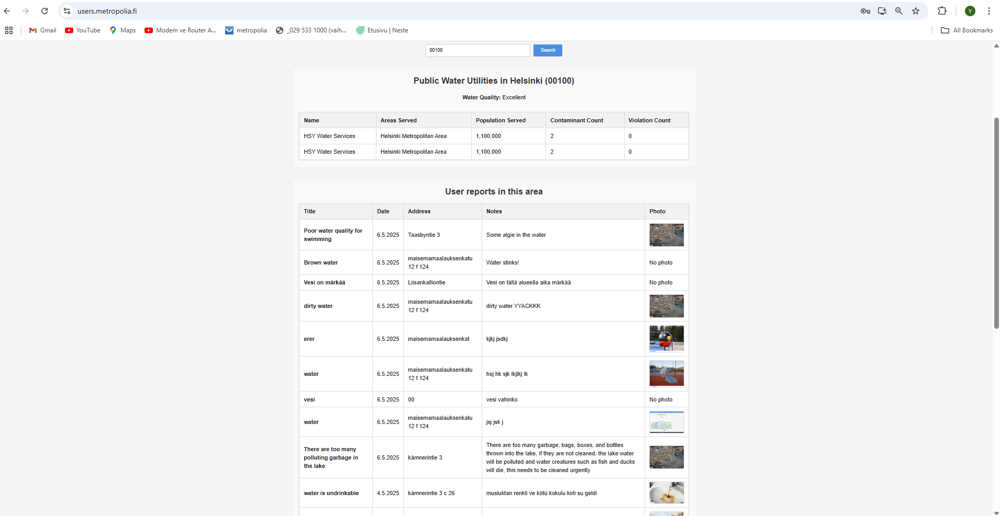
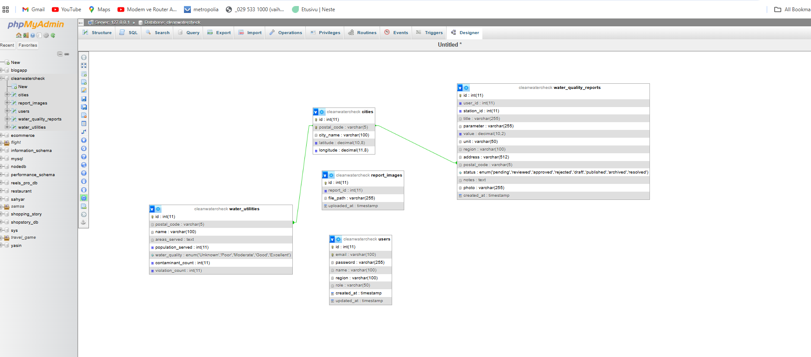

# CleanWaterCheck Finland

## 🌐 Live Application

- **Frontend URL:** [https://users.metropolia.fi/~yasinsay/htcomnet/](https://users.metropolia.fi/~yasinsay/htcomnet/)
- **GitHub Repository:** [https://github.com/yasinSahyar/CleanWaterCheck](https://github.com/yasinSahyar/CleanWaterCheck)

---

## 🖼️ UI Screenshots

| Homepage | City Search & Results | Contaminant Info | Report Form | Login/Register | About Page | User Reports |
|----------|----------------------|------------------|-------------|----------------|------------|-------------|
|  |  |  |  |  |  |  |

---

## 🧩 Features & Functionality

✅ **Implemented features:**
- Role-based user login and registration
- Water quality reporting with map-based location selection
- Interactive map showing all reports
- Public water utility data by city/postal code
- User-submitted reports with photo upload
- Drinking water contaminant information
- Simple, responsive UI (desktop optimized)
- Admin moderation tools

🛠️ **Features suggested but not yet implemented:**
- Like/favorite feature for posts
- Better error messages and field validation
- Full mobile support
- More precise map markers
- Real-time notifications for new reports

---

## 🐞 Known Issues / Bugs

- Login form sometimes fails on first attempt
- Form fields don't always show validation errors clearly
- Mobile layout needs improvement
- All reports may appear under one map pin

---

## 🧪 Testing

- Manual usability testing was conducted with 11 users aged 20–35.
- Feedback included UI clarity and feature suggestions.
- Testing results and analysis available in `/usability-testing/`
- Test cases are in the `/tests` folder

---

## 🗃️ Database Schema

Example database structure:

- **Users:** id, email, password, role  
- **Reports:** id, user_id, location, description, date, status, photo  
- **Comments:** id, report_id, user_id, content, timestamp



---

## 📚 References and Resources

- [React](https://reactjs.org/)
- [Node.js](https://nodejs.org/)
- [Express.js](https://expressjs.com/)
- [MongoDB](https://mongodb.com/)
- [Leaflet.js](https://leafletjs.com/) – for interactive maps
- [Material-UI](https://mui.com/) – for UI components
- [Formik](https://formik.org/) & [Yup](https://github.com/jquense/yup) – for forms and validation
- [Traversy Media](https://www.youtube.com/@TraversyMedia)
- [MDN Web Docs](https://developer.mozilla.org)

---

## 📦 Repository Structure

```
/frontend      # React frontend
/backend       # Express backend
/screenshots   # UI screenshots for documentation
/diagrams      # Diagrams like database schema
/tests         # Automated or manual test scripts
/usability-testing # Usability test results and analysis
```

---

## 📝 Authors

Project developed by **Group 5** – Metropolia University of Applied Sciences  
Course: Full Stack Web Development

---

## 📝 Project Description

**CleanWaterCheck Finland** was developed to address the need for accessible, up-to-date information about drinking water quality in Finland.  
The main goals of the project are:

- To help residents and visitors easily check the quality and safety of their local water supply.
- To allow users to report water quality issues and view reports from others in their area.
- To centralize public water utility data and user feedback in one easy-to-use platform.
- To raise awareness about water contaminants and promote community participation in environmental monitoring.

By combining official data with community reports, CleanWaterCheck Finland empowers users to make informed decisions about their water and encourages transparency and accountability in water management.

---
